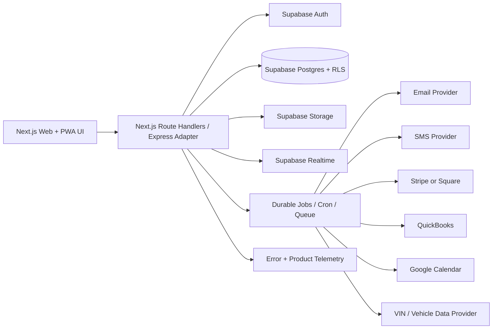
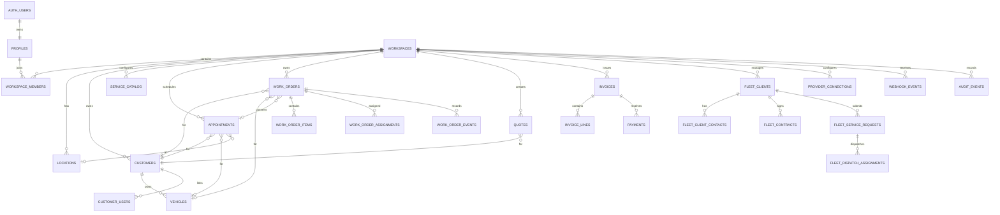

# ServiceWriterFinal Platform, Database, Integrations, and Enhancement Specification

## 1. Platform architecture

The recommended production architecture is a split deployment. The preserved frontend remains a browser application while the new application is migrated into Next.js App Router. The API is a versioned server-side boundary that can run as Next.js route handlers on Vercel and can share domain services with an Express adapter when a traditional API runtime is needed. Supabase provides Auth, Postgres, Storage, Realtime, and database-level row security.

The browser should call the API for business commands and sensitive reads. Direct browser access to Supabase is acceptable only for carefully reviewed, low-risk, tenant-scoped reads or Realtime subscriptions. The server must own authorization orchestration, idempotency, provider calls, audit events, and high-risk actions.

## 2. Database diagram

The canonical tenant key is `workspace_id`. Every tenant-owned table must carry it, and every server query must scope by it. Composite foreign keys should be used where a child references a tenant-owned parent so that a record from one workspace cannot be attached to a record from another workspace. The referenced parent must declare `UNIQUE (workspace_id, id)`; this avoids the migration error encountered during the first schema run.

## 3. Integration catalog

The preserved frontend references a larger set of integrations than should be enabled in MVP. The table below separates current product intent from recommended delivery priority.

| Integration | Current frontend/product signal | MVP disposition | Implementation boundary |
|---|---|---|---|
| Supabase Auth | Existing auth commands and auth-aware UI | P0 | Server session validation, workspace membership, invitation flow. |
| Supabase Postgres/RLS | Existing database client and replacement SQL template | P0 | Server repositories plus reviewed RLS for defense in depth. |
| Supabase Storage | Logo, assets, attachments, inspection media | P0 | Private buckets, signed URLs, MIME/size validation, scan hook. |
| Supabase Realtime | Existing realtime patterns | P1 | Work-order and dispatch invalidation/subscription after core commands are stable. |
| Stripe | Payment, invoice, billing, payout references | P0/P1 | Checkout/payment links and webhook reconciliation first; subscriptions later. |
| Square | Existing payment-provider concepts | P1 | Adapter interface; enable only after Stripe proves the contract. |
| QuickBooks Online | Existing accounting commands/settings | P1 | Export/sync invoice and payment summaries with reconciliation UI. |
| Google Calendar | Existing appointment sync commands | P1 | OAuth connection, event upsert, conflict status, retry queue. |
| Email provider | Existing email/newsletter/transactional flows | P0 | Resend/Postmark-like provider adapter, templates, suppression, delivery log. |
| SMS provider | Existing SMS settings and notification flows | P0/P1 | Twilio-like adapter, opt-out enforcement, rate limits, delivery status. |
| Mapbox/geocoding | Existing maps and geocode references | P1 | Server geocode proxy plus client map token restrictions. |
| CARFAX / vehicle history | Existing CARFAX commands | P2 | Async lookup, cost guardrail, cached response, user-triggered only. |
| Vehicle data/MOTOR | Template vocabulary and competitor parity | P2 | Provider adapter, never block job creation on enrichment. |
| ElevenLabs/voice | Existing voice and AI assistant surface | P2 | Explicit opt-in, transcription redaction, usage limits. |
| PostHog | Existing analytics integration | P1 | PII-masked product events, workspace-safe identity, opt-out. |
| Sentry | Existing error instrumentation | P1 | PII scrubbing, release tagging, environment separation. |
| AI provider | Existing assistant and AI edge-function references | P2 | Server-only gateway, structured tools, confirmation for side effects. |
| MCP/agent integrations | Existing legacy Lovable MCP surface | Retire for MVP | Rebuild later as a documented API/webhook surface, not as a platform dependency. |

## 4. Third-party implementation plan

All providers must implement the same adapter contract: `connect`, `disconnect`, `healthCheck`, `create`, `update`, `receiveWebhook`, `reconcile`, and `redact`. Provider calls must carry a workspace-scoped correlation ID and idempotency key. Provider credentials are stored outside ordinary client-readable rows; the database stores a secret reference, connection status, scopes, external account identifier, last successful sync, and last error.

Payments begin with hosted payment links and webhook reconciliation. Do not store card data. A payment event is accepted only after signature verification, provider event deduplication, invoice/workspace lookup, and an allowed state transition. The UI must show `pending reconciliation` when the browser does not receive an immediate confirmation.

Email and SMS begin with transactional messages: appointment confirmation, status change, approval request, invoice/payment link, and technician/customer reply. Marketing sends are a separate queue and must enforce consent and suppression immediately before provider submission. Templates are versioned and brand snapshots are immutable per message.

Google Calendar sync is one-way from the product to the calendar for the first release unless conflict rules are explicitly defined. Every event stores the external event ID, etag/version if available, last sync state, and an error message safe for staff display. A failed sync never changes the core appointment truth.

QuickBooks sync begins as an explicit export or controlled invoice/payment synchronization rather than a bidirectional accounting engine. Reconciliation screens must show unmatched, duplicated, and rejected records. Accounting integration must never alter historical invoice totals without an auditable correction.

Maps and vehicle data are enrichment services. They may improve address validation, routing, VIN data, and maintenance recommendations, but they cannot block core shop or fleet operations. Cache responses with provider terms and avoid storing unnecessary raw third-party payloads.

## 5. Privacy and PII marketing model

The platform distinguishes operational PII from marketing eligibility. Customer records may contain name, email, phone, address, vehicle identifiers, notes, and communication history. Marketing eligibility is computed from consent, source, channel, legal basis, suppression, bounce/complaint status, and workspace policy. A marketing campaign stores an audience definition, a materialized send snapshot, and delivery outcomes without copying all customer PII into campaign records.

Every send has these controls:

| Control | Requirement |
|---|---|
| Consent | Channel-specific consent or permitted transactional basis. |
| Suppression | Global, workspace, customer, channel, bounce, complaint, and campaign-level suppression. |
| Fresh check | Re-evaluate eligibility immediately before provider send. |
| Unsubscribe | One-click unsubscribe for applicable channels and immediate suppression update. |
| Audit | Record who created, approved, sent, paused, and exported the campaign. |
| Redaction | Do not place full email, phone, VIN, or message body in application logs. |
| Retention | Define deletion/anonymization schedule and legal retention exceptions. |

## 6. Frontend enhancement opportunities

The preserved frontend is broad and visually valuable, but it exposes legacy product complexity. The most important enhancements are not more modules; they are reductions in decision cost.

| Opportunity | Enhancement | Expected effect |
|---|---|---|
| Today-first home | Role-specific Today page with only urgent, next, blocked, and waiting work | Reduces dashboard scanning. |
| Unified command palette | Search customers, vehicles, jobs, fleet clients, and actions with permission-aware results | Gives Monday.com power without additional navigation. |
| Context drawer | Open customer/vehicle/job history without losing board position | Reduces context switching. |
| Exception inbox | Failed payments, missing approval, late technician, sync error, and customer reply in one queue | Converts hidden failures into manageable work. |
| Progressive forms | Basic fields first; advanced pricing, tax, integration, and custom metadata on demand | Lowers cognitive load. |
| Saved role views | Owner, dispatcher, technician, and office presets with personal customization | Makes the product feel purpose-built. |
| Mobile job mode | Large action buttons, offline state, camera-first evidence, minimal typing | Improves technician completion reliability. |
| Explainable automation | Every automation says what happened, why, and how to undo/disable it | Builds trust. |
| Brand preview | Preview customer email, invoice, portal, and payment link before publishing branding | Prevents embarrassing output. |
| Safe bulk actions | Selection summary, dry run, impact count, and undo window | Enables power-user efficiency safely. |

## 7. Platform documentation requirements

The repository must contain an architecture decision record for tenancy, auth, provider secrets, asynchronous work, and browser/API boundaries. It must contain OpenAPI or generated route contracts, environment variable reference, local setup guide, deployment runbook, incident runbook, data export/delete runbook, provider onboarding checklist, and a migration/import guide.

## References

[1]: https://supabase.com/docs/guides/auth — Supabase Auth documentation.

[2]: https://supabase.com/docs/guides/database/postgres/row-level-security — Supabase Row Level Security documentation.

[3]: https://stripe.com/docs/webhooks — Stripe webhook verification and event handling guidance.

[4]: https://developers.google.com/calendar/api/guides/overview — Google Calendar API overview.
