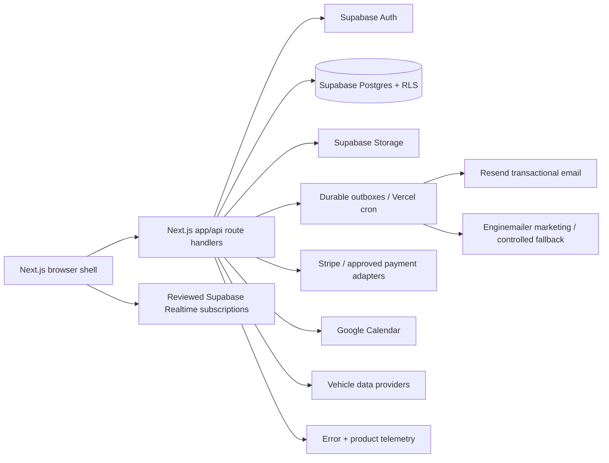
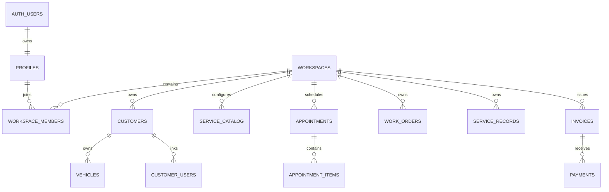

# ServiceWriterFinal Platform and Integrations Specification

**Architecture authority:** `docs/application-architecture-baseline.md`  
**Schema authority:** `scripts/schema-contract.json`

## 1. Platform architecture

Service Writer runs as one Next.js App Router application on Vercel. The preserved interactive product UI is mounted as a client shell inside Next.js; React Router is retained only as an internal compatibility navigation layer. `app/api/**` is the canonical server API. There is no second production frontend or API runtime.

The browser may perform carefully reviewed tenant-scoped reads and Realtime subscriptions. Authorization orchestration, privileged writes, provider calls, idempotency, webhook verification, audit-sensitive operations, and background processing belong to the server/database boundary.

## 2. Tenancy and database contract

`workspace_id` is the canonical tenant key. Tenant-owned records and server queries must be scoped by workspace. Cross-workspace relationships must be rejected by authorization and database constraints/RLS as appropriate.

Core relationships include:

The live schema—not a retired frontend model—is authoritative. `scripts/check_schema_contract.py` blocks runtime use of known retired tables, columns, RPCs, and Edge Functions.

## 3. Authentication and authorization

Supabase Auth owns identity. Workspace membership and role policy determine staff authorization. Customer identity uses the canonical customer-user linkage rather than treating a customer as a staff member.

Frontend guards improve navigation and UX but do not replace server authorization or RLS. Service-role credentials are server-only and must never be exposed through client-visible configuration.

## 4. Integration ownership

| Integration | Production role | Boundary |
|---|---|---|
| Supabase Auth | Identity/session | Browser session + server validation |
| Supabase Postgres/RLS | Canonical business state and row authorization | Database/server |
| Supabase Storage | Attachments/assets/media | Signed/private access rules |
| Supabase Realtime | Reviewed live invalidation/subscriptions | Browser with RLS |
| Resend | Primary transactional application email | Server messaging adapter |
| Enginemailer | Growth/marketing; controlled transactional fallback | Server messaging adapter |
| Stripe | Payments and reconciliation | Server adapter + signed webhooks |
| Square | Optional payment adapter when enabled | Server adapter + signed webhooks |
| Google Calendar | Appointment synchronization | Server integration |
| SMS provider | Transactional SMS when enabled | Server messaging adapter |
| Mapbox/geocoding | Maps/address enrichment | Restricted browser token + server proxy where sensitive |
| Vehicle data | VIN/spec enrichment | Server/provider adapter or intentionally public catalog boundary |
| PostHog | Product analytics | PII-minimized browser/server events |
| Sentry | Error observability | PII-scrubbed client/server instrumentation |

Integrations are capabilities, not domain authorities. Appointment truth stays in Service Writer even if calendar sync fails; invoice/payment truth follows the canonical ledger/reconciliation rules even if a provider is delayed.

## 5. Messaging contract

Domain services call the internal `MessagingAdapter` contract. Provider-specific response bodies remain inside adapters.

Transactional lifecycle mail uses Resend first. Enginemailer owns marketing/growth and may be used only as the configured fallback when a transactional Resend attempt fails before acceptance. All sends must be workspace-scoped and idempotent. Marketing additionally requires fresh consent and suppression checks.

Provider credentials are server-only. Browser code never imports provider credentials or performs privileged provider HTTP calls.

## 6. Payment contract

Payment events are accepted only after provider-signature verification, event deduplication, workspace/invoice resolution, and a permitted state transition. Browser success screens are not financial truth. Reconciliation must tolerate duplicate and out-of-order webhooks.

Card data is never stored directly by Service Writer.

## 7. Calendar and enrichment contract

Google Calendar is an integration projection, not the appointment source of truth. Failed synchronization must never mutate or invalidate the canonical appointment.

Maps and vehicle data are enrichment services. They may improve address validation, routing, VIN decoding, specifications, and recommendations, but nonessential enrichment failures must not corrupt core operational records.

## 8. Privacy and PII

Operational PII and marketing eligibility are separate concerns. Customer records may contain name, email, phone, address, vehicle identifiers, and service history; marketing use requires the applicable consent/suppression policy.

Logs and telemetry must avoid full email, phone, VIN, provider payloads, card data, or message bodies unless explicitly required and protected. Provider webhooks are normalized before domain use.

## 9. Environment contract

The canonical runtime uses `NEXT_PUBLIC_*` for browser-visible values and unprefixed names for server secrets. Runtime `VITE_*` variables are retired. See `docs/environment-and-secrets-manifest.md`.

## 10. Operational UX principles

High-value product improvements should reduce decision cost rather than create duplicate operational modules. Preferred patterns include a Today-first home, role-specific saved views, context drawers, exception queues, progressive forms, safe bulk actions, mobile technician mode, and explainable automation.

Dispatch/scheduling, messaging, payments, and other consequential workflows should have one canonical mutation path even when multiple screens expose it.

## 11. Documentation and change control

Any change that alters deployment topology, tenant ownership, server/browser responsibility, auth authority, or provider ownership must update:

1. `docs/application-architecture-baseline.md`;
2. `scripts/architecture-contract.json`;
3. `scripts/check-architecture-contract.mjs` when enforcement changes;
4. the relevant schema/provider contract and tests.

Architecture changes are not complete until CI enforces the new contract and an exact-SHA Vercel preview proves the consolidated application still builds.
