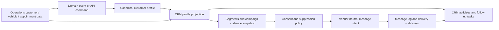

# CRM Dashboard RBAC and Shared Customer Synchronization Design

## 1. Design principles

The CRM is a separate top-level dashboard inside the same Service Writer platform. It is not a second application, database, or customer master. Operations owns service execution; CRM owns relationship management and marketing workflows. Both domains use the same authenticated user, `workspace_id`, canonical customer identity, consent state, suppression rules, and audit model.

The central rule is:

> Operations and CRM may maintain different views and domain records, but they must never create competing customer identities for the same workspace.

Every CRM table is workspace-scoped. Every API route derives the workspace from the authenticated session or an authorized workspace-selection operation rather than trusting a client-supplied workspace ID. All write commands validate payloads with Zod before reaching the API boundary.

## 2. Dashboard and route boundary

The application presents a role-aware dashboard toggle:

```text
Operations  ↔  CRM
```

Operations routes remain responsible for scheduling, dispatch, technician work, customers, vehicles, work orders, invoices, and payments. CRM routes are grouped under `/crm` and are responsible for relationship profiles, leads, follow-ups, segments, campaigns, loyalty, and outreach analytics.

A user may have access to both dashboards. The toggle changes the product surface and navigation but never changes the workspace, session, or authorization claims.

## 3. Roles and permissions

The existing workforce roles remain the foundation. CRM access is an additional capability set rather than a replacement for `owner`, `manager`, `technician`, `dispatcher`, or `viewer`.

| Role or capability | Operations access | CRM access | Typical user |
|---|---|---|---|
| Platform admin | Cross-workspace support only through audited administrative paths | Configuration and support access, never ordinary tenant browsing by default | Platform operator |
| Workspace owner | Full workspace operations | Full CRM administration, campaigns, loyalty, exports, and approvals | Business owner |
| Workspace manager | Full or delegated operations | CRM management, customer follow-ups, campaign drafts, and reports according to grant | Office manager |
| Dispatcher | Schedule, dispatch, appointment status, technician coordination | Read customer context and create operational follow-ups; no campaign send by default | Dispatcher |
| Technician | Assigned jobs, vehicles, service history, customer context required for work | No CRM navigation by default; may see approved customer context only | Technician |
| CRM manager | No automatic operational write access | Profiles, leads, tasks, segments, campaign drafts, campaign approval if granted | Marketing or customer-success user |
| CRM operator | Read customer context | Manage follow-ups, audience membership, templates, and campaign execution within approval limits | Office or marketing staff |
| CRM analyst | Read-only operational context | Read-only CRM reports and campaign analytics; no exports unless granted | Analyst |
| Viewer | Read-only assigned workspace data | Read-only CRM data if explicitly granted | Auditor or limited staff |

CRM capabilities should be represented as explicit grants, for example:

```text
crm.view
crm.profile.write
crm.lead.write
crm.task.write
crm.segment.manage
crm.campaign.draft
crm.campaign.approve
crm.campaign.send
crm.loyalty.adjust
crm.export
crm.settings.manage
```

The owner receives all CRM capabilities for the workspace. Other users receive only explicit grants or role-derived defaults. `crm.campaign.send`, `crm.loyalty.adjust`, and `crm.export` should never be implied merely by being able to view CRM records.

## 4. Proposed database schema

The following schema extends the canonical operational model. Names should be reconciled against the repository’s existing naming conventions before migration.

### `crm_profiles`

One workspace-specific CRM profile per canonical customer. It contains relationship metadata, not duplicated identity fields.

| Column | Type | Rule |
|---|---|---|
| `id` | uuid | Primary key. |
| `workspace_id` | uuid | Required; indexed and RLS-scoped. |
| `customer_id` | uuid | Required foreign key to canonical customer; unique per workspace. |
| `lifecycle_stage` | enum/text | New lead, contacted, qualified, booked, active, due, at risk, reactivated, inactive. |
| `lead_source` | text | Nullable attribution source. |
| `relationship_owner_id` | uuid | Nullable workspace member reference. |
| `next_action_at` | timestamptz | Nullable follow-up date. |
| `preferred_channel` | text | Nullable; must not override consent. |
| `last_contacted_at` | timestamptz | System-maintained. |
| `last_service_at` | timestamptz | Derived from operations. |
| `created_at`, `updated_at` | timestamptz | System-maintained. |

Constraint: `unique(workspace_id, customer_id)`.

### `crm_activities`

Append-only relationship timeline entries. Activities reference canonical records instead of copying their contents.

| Column | Type | Rule |
|---|---|---|
| `id` | uuid | Primary key. |
| `workspace_id` | uuid | Required. |
| `customer_id` | uuid | Required. |
| `vehicle_id` | uuid | Nullable. |
| `appointment_id` | uuid | Nullable. |
| `activity_type` | text | Call, note, follow-up, campaign interaction, review, referral, service milestone. |
| `summary` | text | Validated length and sanitized. |
| `occurred_at` | timestamptz | Required. |
| `created_by` | uuid | Authenticated actor or system actor. |
| `source_event_id` | uuid/text | Idempotency reference. |

### `crm_leads` and `crm_tasks`

`crm_leads` stores CRM opportunity state linked to a canonical customer when known. Unknown leads may exist only when the workspace explicitly permits prospective contacts and consent policy allows storage. `crm_tasks` stores follow-up actions and can optionally reference an appointment or booking link, but cannot directly alter appointment state.

### `crm_segments`

Stores a named, workspace-scoped audience definition. A segment should store a versioned JSON definition and a human-readable explanation. Segment evaluation must be server-side and must apply workspace isolation, consent, suppression, and channel eligibility.

### `crm_campaigns`

Stores campaign metadata and lifecycle state.

```text
 draft → pending_approval → approved → scheduled → sending → paused/completed/cancelled
```

Important fields include `workspace_id`, `name`, `purpose`, `channel`, `template_id`, `segment_id`, `approval_state`, `scheduled_at`, `frequency_policy`, `created_by`, `approved_by`, and timestamps. A campaign cannot send unless it is approved and its audience snapshot is complete.

### `crm_campaign_members`

Stores an immutable audience snapshot. It references `campaign_id`, `workspace_id`, `customer_id`, destination, eligibility decision, suppression decision, delivery status, and message intent ID. This prevents a customer’s later profile change from silently changing the meaning of a historical campaign.

### `crm_loyalty_accounts` and `crm_loyalty_ledger`

A loyalty account is unique per workspace/customer. The ledger is append-only and records points earned, redeemed, expired, or manually adjusted. Adjustments require an explicit capability and audit event. Current balance is derived or maintained transactionally from the ledger; it must not be edited as an untracked number.

### `crm_permissions` and `crm_audit_events`

`crm_permissions` stores explicit workspace-member capability grants where role defaults are insufficient. `crm_audit_events` records permission changes, exports, campaign approvals/sends, suppression overrides, loyalty adjustments, profile merges, and synchronization conflicts.

## 5. RLS and authorization rules

Every CRM table enables RLS and uses the same workspace membership predicate as the hardened Operations tables. A representative policy shape is:

```sql
using (
  workspace_id = public.current_workspace_id()
  and public.has_workspace_capability('crm.view')
)
```

Writes add the capability-specific predicate:

```sql
with check (
  workspace_id = public.current_workspace_id()
  and public.has_workspace_capability('crm.campaign.draft')
)
```

Sensitive commands should use server-side API routes and database functions that validate the session, workspace membership, capability, consent, suppression, and idempotency token in one transaction. No anonymous role may read or write CRM tables. Platform-admin bypasses must be explicit, audited, and separate from ordinary tenant RLS paths.

## 6. Shared customer profile data flow

Operations remains the system of record for identity and service facts. CRM stores only CRM-owned attributes and references Operations records.



### Profile creation and update flow

When a customer is created or updated in Operations, the core command validates and writes the canonical customer record. It then emits an idempotent domain event such as `customer.created` or `customer.updated` containing `workspace_id`, `customer_id`, version, changed fields, and source actor.

A CRM projection handler consumes the event and upserts `crm_profiles` by `(workspace_id, customer_id)`. It may update derived CRM fields, but it must not overwrite canonical identity fields. If the event contains a service milestone, the handler may append a CRM activity or recalculate a segment.

When a user edits a CRM-owned field such as lifecycle stage, lead source, relationship owner, or next action, the CRM API updates only CRM tables and emits a CRM activity. It must not write directly to the Operations customer record.

### Shared read model

The customer profile screen may compose data from both domains:

```text
Canonical identity + vehicles + service history + appointments + invoices
  + CRM lifecycle + activities + tasks + consent + campaign history + loyalty
```

The composition should be server-authorized and workspace-scoped. It should not create a materialized duplicate of the customer master in the browser or in a second table unless a clearly versioned read projection is required for performance.

## 7. Conflict and failure handling

Canonical identity conflicts are resolved in Operations, not CRM. If two customer records appear to represent the same person, the merge process must create a durable merge record, retain source lineage, re-point CRM references, and write an audit event. CRM must not silently merge customers based on name similarity.

Projection failures should be retried with bounded backoff and an idempotency key. A failed CRM projection must not roll back a completed appointment, work order, invoice, or payment. The system should expose a workspace-scoped synchronization health view to authorized owners and CRM managers.

If a customer opts out or a destination becomes suppressed, future CRM audience evaluation must exclude the destination. Historical campaign logs remain immutable. Operational messages continue to follow their own approved policy and are not deleted from the audit trail.

## 8. Campaign and loyalty safeguards

A CRM campaign must pass the following gates before sending:

| Gate | Requirement |
|---|---|
| Workspace | Campaign, segment, template, and destination belong to the active workspace. |
| Permission | Actor has draft, approve, or send capability appropriate to the action. |
| Consent | Destination has valid channel consent for the campaign purpose. |
| Suppression | Destination is not globally, workspace-, campaign-, or channel-suppressed. |
| Frequency | Quiet hours and frequency limits permit delivery. |
| Audience | Audience snapshot is complete and records are not ambiguous. |
| Idempotency | Each recipient/channel/campaign send has a stable idempotency key. |
| Audit | Creation, approval, send, pause, cancellation, and delivery events are recorded. |

Loyalty adjustments require the same workspace and capability checks plus an append-only ledger entry. A loyalty promotion can generate a CRM message but cannot alter payment, invoice, appointment, or work-order state.

## 9. Testing requirements

The implementation should include database and application tests for cross-workspace isolation, capability denial, owner dual-dashboard access, technician CRM denial, campaign approval gates, consent and suppression enforcement, idempotent projection replay, profile update propagation, conflict handling, and loyalty ledger immutability.

The end-to-end tests should verify that switching between Operations and CRM preserves the same user and workspace, that CRM-only writes do not mutate operational state, that operational notifications continue when CRM is unavailable, and that an opted-out customer is excluded from all eligible marketing channels.

## 10. Implementation order

1. Add capability resolution to the existing workspace-membership authorization model.
2. Add CRM tables, foreign keys, indexes, RLS, and audit events.
3. Add shared customer projection events and an idempotent CRM profile upsert handler.
4. Build the role-aware Operations/CRM dashboard toggle.
5. Build CRM profiles, activities, tasks, and segments.
6. Add campaign drafts, approvals, audience snapshots, and delivery integration.
7. Add loyalty accounts and the append-only ledger.
8. Add read-only analytics and synchronization health views.
9. Run RLS, authorization, synchronization, consent, and end-to-end tests before enabling campaign sends.

This design keeps CRM powerful enough for marketing and loyalty while ensuring that the daily service application remains focused, stable, and independent from optional outreach workflows.
